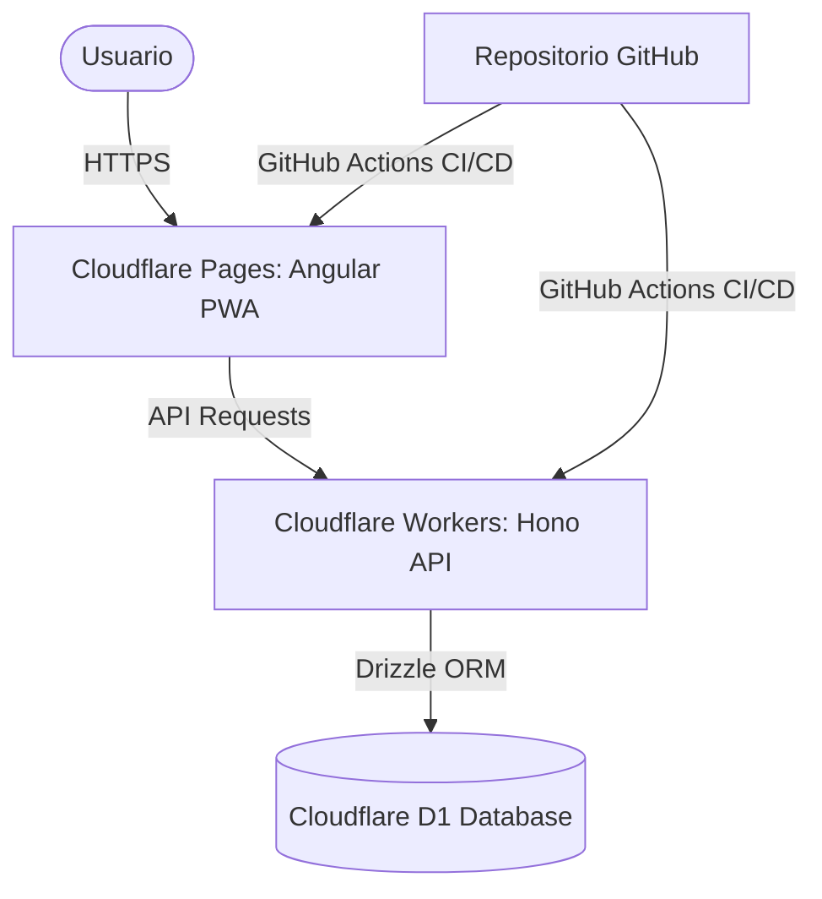

# Plan de Implementación: PWA Básica con Angular, Tailwind, Hono, D1, Drizzle y CI/CD

Este plan detalla los pasos para construir y desplegar un ciclo básico completo de una Aplicación Web Progresiva (PWA) con un backend en Hono, base de datos D1 (SQLite en Cloudflare) usando Drizzle ORM, y despliegue continuo mediante GitHub Actions.

---

## 🛠️ Arquitectura del Proyecto

La estructura del proyecto será un monorepo simple:
- `backend/`: API Hono corriendo en Cloudflare Workers, usando Drizzle ORM para interactuar con Cloudflare D1 (Base de datos SQL).
- `frontend/`: Aplicación Angular configurada como PWA, con estilos de Tailwind CSS, desplegada en Cloudflare Pages.

---

## 📅 Fases del Plan

### Fase 1: Configuración Inicial del Monorepo
1. Crear la estructura de directorios (`backend/` y `frontend/`).
2. Configurar el backend con Hono, Wrangler, Drizzle ORM y D1.
3. Configurar el frontend con Angular, Tailwind CSS y soporte PWA.

### Fase 2: Desarrollo del Backend (Hono + Drizzle + D1)
1. Definir el esquema de la base de datos con Drizzle (ej. una tabla de tareas/`todos`).
2. Generar y aplicar la primera migración en local y producción (D1).
3. Implementar endpoints básicos de CRUD en Hono.
4. Habilitar CORS en Hono para permitir peticiones desde el frontend.

### Fase 3: Desarrollo del Frontend (Angular + Tailwind + PWA)
1. Configurar Tailwind CSS en Angular.
2. Añadir la capacidad de PWA (Service Worker, manifest.json, iconos).
3. Crear un servicio en Angular para conectar con la API de Hono.
4. Diseñar una interfaz interactiva y premium usando Tailwind CSS para listar, añadir y completar tareas.

### Fase 4: Configuración de CI/CD con GitHub Actions
1. Configurar `.github/workflows/deploy-backend.yml` para desplegar la API a Cloudflare Workers cuando haya cambios en `/backend`.
2. Configurar `.github/workflows/deploy-frontend.yml` para compilar y desplegar la app de Angular a Cloudflare Pages cuando haya cambios en `/frontend`.

---

## ⚡ Lo que debes hacer tú en Cloudflare

Para que la automatización y el despliegue funcionen correctamente, necesitamos preparar algunos recursos en tu cuenta de Cloudflare. Sigue estos pasos en el [Panel de Cloudflare](https://dash.cloudflare.com/):

### 1. Crear la Base de Datos D1
La base de datos D1 guardará la información de nuestra app.
1. Ve a **Workers y Pages** > **D1**.
2. Haz clic en **Create database** (Crear base de datos).
3. Selecciona **Dashboard** (consola).
4. Dale el nombre: `ikis-db`
5. Haz clic en **Create**.
6. **Copia el `database_id`** (un UUID largo) que te muestra Cloudflare. Lo usaremos en la configuración del backend.

### 2. Crear un Token de API para GitHub Actions
Para que GitHub pueda desplegar tus servicios a tu nombre:
1. En la esquina superior derecha del panel de Cloudflare, haz clic en el icono de tu perfil y selecciona **My Profile** (Mi Perfil) > **API Tokens**.
2. Haz clic en **Create Token**.
3. Selecciona la plantilla **Edit Cloudflare Workers** (Editar Cloudflare Workers).
4. Configura los permisos (por defecto suelen incluir permisos para Workers, D1 y Pages). Asegúrate de que tenga:
   - *Account - Cloudflare Pages - Edit*
   - *Account - Workers Scripts - Edit*
   - *Account - Workers KV Database - Edit* (o D1/etc.)
5. En **Account Resources**, selecciona tu cuenta.
6. En **Zone Resources**, selecciona **All zones** (o las que desees).
7. Haz clic en **Continue to summary** y luego en **Create Token**.
8. **Copia el Token generado** inmediatamente (no se volverá a mostrar). Lo guardaremos en GitHub como `CLOUDFLARE_API_TOKEN`.

### 3. Obtener tu Account ID
1. Ve a la página de inicio del Dashboard de Cloudflare o a cualquier sección de Workers.
2. En la barra lateral derecha o en la URL, busca tu **Account ID** (un hash de 32 caracteres).
3. Copia este valor. Lo guardaremos en GitHub como `CLOUDFLARE_ACCOUNT_ID`.

### 4. Crear un Proyecto de Cloudflare Pages (Frontend)
Aunque podemos dejar que Wrangler lo cree automáticamente, es recomendable tenerlo listo:
1. Ve a **Workers y Pages** > **Overview** y haz clic en **Create application** (Crear aplicación).
2. Ve a la pestaña **Pages** y haz clic en **Upload assets** (Subir recursos de forma manual).
3. Nombra el proyecto como `ikis-web`.
4. Haz clic en **Create project** (no necesitas subir archivos todavía, el pipeline de GitHub se encargará).

---

## 🔒 Secretos a Configurar en tu Repositorio de GitHub

Cuando tengas tu repositorio en GitHub creado, ve a **Settings** > **Secrets and variables** > **Actions** y añade los siguientes **Repository secrets**:

1. `CLOUDFLARE_API_TOKEN`: El token de API que creaste en el paso 2.
2. `CLOUDFLARE_ACCOUNT_ID`: El ID de tu cuenta de Cloudflare del paso 3.
