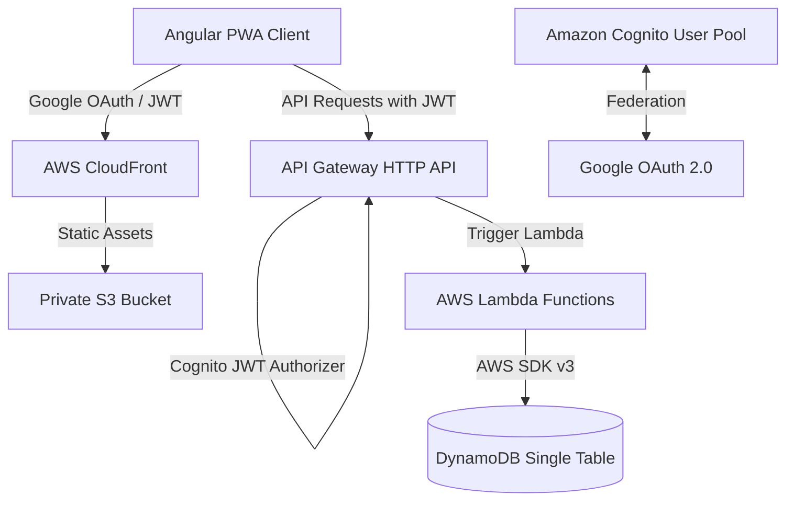

# Memoria del Proyecto - Ikis Expense Control (Personal Expense Tracker PWA)

Este archivo sirve como fuente de contexto persistente sobre el estado, arquitectura, diseño de base de datos y flujo de trabajo del proyecto **Ikis Expense Control**. Debe ser actualizado cada vez que se realicen cambios estructurales significativos.

---

## 1. Resumen del Proyecto

**Ikis Expense Control** (originalmente concebido como *Personal Expense Tracker PWA*) es una aplicación web progresiva (PWA) serverless y orientada a la producción para la gestión de finanzas personales. Permite a los usuarios realizar un seguimiento detallado de sus ingresos, gastos y transferencias entre cuentas en una infraestructura segura y de bajo costo en AWS.

### Objetivos Principales:
* **PWA Multiplataforma**: Frontend rápido e instalable construido con Angular.
* **Serverless de Bajo Costo**: API construida sobre AWS Lambda y API Gateway (HTTP API), minimizando costos en reposo.
* **Seguridad y Aislamiento**: Inicio de sesión federado con Google OAuth a través de Amazon Cognito, con validación de JWT a nivel de API Gateway y derivación segura de `userId` en el backend.
* **Base de Datos NoSQL Eficiente**: Almacenamiento en DynamoDB optimizado mediante diseño de tabla única (Single-Table Design).

---

## 2. Estado Actual del Proyecto (En Construcción)

El proyecto se encuentra actualmente en una fase de **transición y desarrollo activo**:

1. **Migración de Modelo**: El sistema está migrando de un modelo simple de **Gastos Únicos (`expenses`)** a un modelo financiero completo que maneja:
   * **Cuentas (`accounts`)**: Efectivo, cuentas corrientes, cuentas de ahorro y tarjetas de crédito.
   * **Categorías (`categories`)**: Clasificación personalizable para ingresos y gastos (con colores dinámicos).
   * **Transacciones (`transactions`)**: Movimientos de dinero (Gasto, Ingreso, Transferencia entre cuentas).
   
2. **Frontend**:
   * Implementado con Angular 21 (componentes standalone) y Tailwind CSS.
   * El panel principal ([home.component.ts](file:///home/rene/projects/ikis/frontend/src/app/pages/home/home.component.ts)) ya ha sido actualizado para interactuar con la nueva API de finanzas (Cuentas, Categorías y Transacciones).
   
3. **Backend Local vs. Producción (Brecha Actual)**:
   * **Servidor Local (`backend/src/local/server.ts`)**: Soporta **completamente** los nuevos endpoints de Cuentas, Categorías y Transacciones utilizando `FinanceService` y `FinanceRepository`.
   * **Infraestructura de Producción (`infra/main.tf` e `infra/lambda/`)**: Solo cuenta con los recursos e implementaciones para los endpoints antiguos de gastos (`expenses`):
     * `POST /expenses`
     * `GET /expenses`
     * `GET /expenses/{id}`
     * `PUT /expenses/{id}`
     * `DELETE /expenses/{id}`
   * *Pendiente*: Crear los Lambda handlers y declarar las rutas de API Gateway en Terraform para las entidades de `accounts`, `categories` y `transactions`.

---

## 3. Arquitectura y Stack Tecnológico



* **Frontend**: Angular 21, Tailwind CSS, Service Workers (PWA). Alojado en S3 + CloudFront con OAC (Origin Access Control).
* **Backend**: Node.js 20, TypeScript, AWS SDK v3, Lambda, API Gateway v2 (HTTP API).
* **Autenticación**: Cognito User Pool federado con Google Client ID/Secret.
* **Infraestructura**: Terraform para aprovisionamiento automatizado.
* **CI/CD**: GitHub Actions (Validación de PRs y despliegue automático a la rama `main`).

---

## 4. Diseño de Base de Datos (DynamoDB Single-Table Design)

Para optimizar costos y velocidad, todas las entidades del usuario se almacenan en una única tabla de DynamoDB utilizando claves genéricas.

### Esquema de Claves

* **Clave Primaria de la Tabla (PK y SK)**:
  * **Partition Key (PK)**: `USER#{userId}` para todas las entidades asociadas a un usuario específico.
  * **Sort Key (SK)**: Varía según el tipo de entidad para permitir búsquedas ordenadas y filtradas por prefijo (`begins_with`).

* **Índice Secundario Global (GSI1)**:
  * Permite consultar y validar la existencia de una entidad individual por su ID sin necesidad de escanear toda la partición del usuario o conocer la fecha de creación de antemano.
  * **GSI1PK**: `<ENTITY_TYPE>#{id}` (ej. `ACCOUNT#12345`)
  * **GSI1SK**: `USER#{userId}`

### Estructura de Entidades en DynamoDB

| Entidad | Tipo (`entityType`) | Formato de SK (Sort Key) | Ejemplo de SK | Atributos Clave |
| :--- | :--- | :--- | :--- | :--- |
| **Cuenta** | `ACCOUNT` | `ACCOUNT#{id}` | `ACCOUNT#acc_123` | `name`, `type`, `currency`, `balance`, `createdAt`, `updatedAt` |
| **Categoría** | `CATEGORY` | `CATEGORY#{id}` | `CATEGORY#cat_456` | `name`, `kind` (expense/income), `color`, `createdAt`, `updatedAt` |
| **Transacción** | `TRANSACTION` | `TRANSACTION#{date}#{id}` | `TRANSACTION#2026-06-02#txn_789` | `type` (expense/income/transfer), `amount`, `categoryId`, `fromAccountId`, `toAccountId`, `transactionDate`, `description` |
| **Gasto (Antiguo)** | `EXPENSE` | `EXPENSE#{date}#{id}` | `EXPENSE#2026-06-02#exp_999` | `amount`, `category`, `description`, `expenseDate` |

---

## 5. Estructura del Repositorio

* [frontend/](file:///home/rene/projects/ikis/frontend)
  * [src/app/pages/home/home.component.ts](file:///home/rene/projects/ikis/frontend/src/app/pages/home/home.component.ts): Componente de Angular principal con el Dashboard financiero.
  * [src/app/services/](file:///home/rene/projects/ikis/frontend/src/app/services): Servicios de autenticación (`AuthService`) e integración con la API (`ApiService`).
* [backend/](file:///home/rene/projects/ikis/backend)
  * [src/local/server.ts](file:///home/rene/projects/ikis/backend/src/local/server.ts): Servidor Express/Node local con enrutamiento para todas las rutas financieras y de gastos.
  * [src/models/](file:///home/rene/projects/ikis/backend/src/models): Modelos y tipado TypeScript (`finance.ts` y `expense.ts`).
  * [src/repositories/](file:///home/rene/projects/ikis/backend/src/repositories): Lógica de persistencia en DynamoDB (`financeRepository.ts` y `expenseRepository.ts`).
  * [src/services/](file:///home/rene/projects/ikis/backend/src/services): Lógica de negocio y validaciones (`financeService.ts` y `expenseService.ts`).
  * [src/handlers/](file:///home/rene/projects/ikis/backend/src/handlers): Lambdas de producción (actualmente solo para `expenses`).
* [infra/](file:///home/rene/projects/ikis/infra)
  * [main.tf](file:///home/rene/projects/ikis/infra/main.tf): Definición de la infraestructura serverless de AWS.
* [docs/](file:///home/rene/projects/ikis/docs)
  * [local-development.md](file:///home/rene/projects/ikis/docs/local-development.md): Guía de desarrollo local.
  * [setup.md](file:///home/rene/projects/ikis/docs/setup.md): Requisitos previos y despliegue.

---

## 6. Flujo de Desarrollo Local

Para trabajar en funciones locales sin interactuar con los recursos en la nube de AWS, se utiliza el script de automatización [`local.sh`](file:///home/rene/projects/ikis/local.sh) en la raíz del proyecto:

* **Iniciar todos los servicios** (Docker DynamoDB, setup de base de datos, backend y frontend en segundo plano):
  ```bash
  ./local.sh start
  ```
* **Ver estado de los servicios** (comprueba si están activos los puertos de la base de datos, backend y frontend):
  ```bash
  ./local.sh status
  ```
* **Detener todos los servicios** (apaga los servidores y contenedores Docker liberando los puertos):
  ```bash
  ./local.sh stop
  ```
* **Ver logs en tiempo real**:
  * Para el Backend: `./local.sh logs backend`
  * Para el Frontend: `./local.sh logs frontend`
* **Reiniciar servicios**:
  ```bash
  ./local.sh restart
  ```

---

## 7. Próximos Pasos (Roadmap de Desarrollo)

Para completar la transición al nuevo sistema financiero:
1. **Crear Lambdas de Producción**: Desarrollar los archivos `.ts` en `backend/src/handlers/` para Cuentas, Categorías y Transacciones (ej. `createAccount.ts`, `listAccounts.ts`, etc.), replicando la lógica que ya tiene el servidor local de desarrollo.
2. **Actualizar Terraform (`infra/main.tf`)**: Declarar las nuevas funciones Lambda en la variable local `lambda_handlers` de Terraform para mapear las rutas de API Gateway correspondientes (ej. `POST /accounts`, `GET /categories`, etc.).
3. **Migración de Datos**: Si ya existen datos de gastos antiguos en AWS, se debe planificar cómo adaptarlos o si se asumen como transacciones directamente asociadas a una cuenta "Por defecto".
